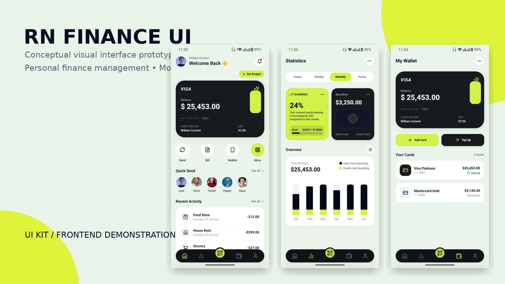

     
       
  
  
  
  
     

# PERSONAL FINANCE UI PROTOTYPE.

## ABOUT THE PROJECT
**RN Finance UI** is a **conceptual visual interface prototype (UI Kit)** focused on personal finance management. Built to showcase modern layouts, high visual fluidity, and mobile UX best practices.

It is a frontend demonstration that simulates the user experience of a financial dashboard ideal for serving as a design base or studying mobile interfaces built with React Native and NativeWind v4.

> ⚠️ **Note:** This repository is strictly a **visual prototype (UI Concept)**. It does not contain integrations with real backend services or databases.

---

### Key Highlights & UI Concepts

- **Dashboard & Analytics Layout:** Visual components designed for intuitive spending charts and category breakdowns.
- **Wallet & Account Views:** Conceptual screens for seamless navigation across multiple accounts and cards.
- **Native Design System:** Built with design tokens tailored for a modern aesthetic using React Native + NativeWind v4.
- **Smooth & Responsive Interface:** Engineered for a 60 FPS user experience with clean, reusable components.

---

## **📸 DEMO**

 
   
    
  <i>UI FINANCE</i> 

---

### 📚 DOCUMENTATION & SETUP

#### 🚀 Getting Started
- [Running the Project](./apps/mobile/README.md): Instructions on how to set up the environment, run the Expo development server, and preview the UI on your device or emulator.

#### 🎨 Design & Specs
- [UI Specifications](./docs/specs/requirements.md): Details about screen flows, color tokens, typography, and component guidelines.

---

## ⚠️ APK INSTALLATION NOTE
The original test APK size is **107.6MB**. To optimize repository size and download speed, it has been compressed into a **46.6MB** `.zip` archive. 

👉 **How to install:** Download the `.zip` file, extract it to your Android device to access the `.apk`, and then proceed with the installation.

---

## LICENSE
This project is licensed under the MIT License. See the [LICENSE](./LICENSE) file for details.
